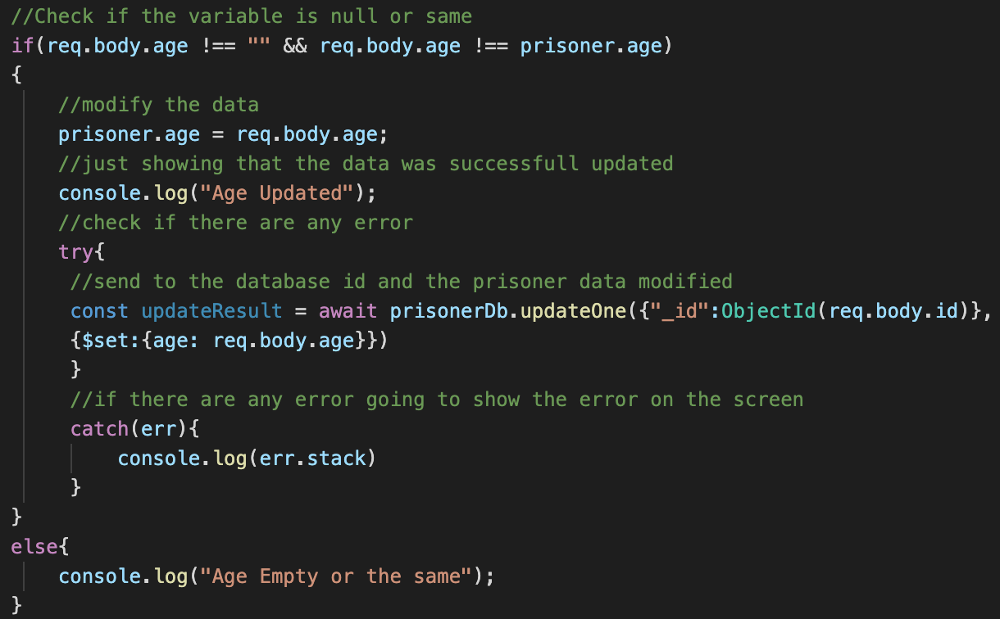

# College Portal - Thiago Santos
## BackEnd Web Development - Assignment 
#### Dorset College
## What is this?

Web Application to manage prison plant that you have access to data of every single one how are currently on the cells you can also transfer to another cell or/and section of the prison as you wish.

##Walkthrough:

*Node.js Setup:https://nodejs.org/en/docs/guides/

*MongoDb Setup:https://www.mongodb.com

Installation Visual Studio.

### $ npm install mongodb --save

*Postman Setup:https://www.postman.com

*Express Setup:https://expressjs.com

Installation Visual Studio.

### $ npm install express --save

*Nodemon Setup:https://nodemon.io

Installation Visual Studio.

### $ npm install -g nodemon

On Mac you should use as administrator 

### $ sudo npm install -g nodemon

## About the Project

The main base of this project is the interaction between the API(Postman) and database(MongoDb) Using four functions(GET, POST, PUT and DELETE) can reach 100% of the functionality of this application.

On the terminal you need to ability the nodemon to reload the server automatically using this comando

###nodemon

Each one of the Functions going to handle one part of the backend as you can see below, I started with the get this going to return the prisoner of the database that matchs with the firstName but is flexible that you can setup different parameters or multiples as well.

First we must connect the Postman with the localhost:3000/"Database you declare" in my case "Prisoner" so should be localhost:3000/Prisoner.

In the function GET going to access the database and find a match so the result going to be this one in my case.

The POST Function going to handle all the new prisoners to the database.

Using the POST function I manualy declared the variables on postman to reach the database and return the status(200) as you can see below.

The PUT Function going to handle all changes that migth be necessary to the prisoner as moving to a different section, cell, beraviour and so on.

Inside of the function i declared some check to handle each input that the user might submit

Using the PUT function I manualy declared the variable on postman to reach the database and return the message "Prisoner Successful Updated"

If submit values empty or the sabe as already initializate going to show the the message "Prisoner Successful Updated" but inside of the console going to show the variable that weren't modified.

As you can see BEFORE modify the prisoner the zone was "C".

As you can see AFTER modify the prisoner the zone was "A".

The DELETE Function going to handle any prisoner as moved out to the prison.

Using the DELETE function going to find the prisoner by his ID and remove from the database and return the message "This prisoner was realeased".

As you can notice that before the comand Delete in the database had 5 inputs as you can see below.

So after delete now has just 4 inputs on the database.

#### Contributors

* [GeorgeBlanaru](https://github.com/georgeBl)

### License
Copyright 2020 - Thiago Dias Dos Santos
